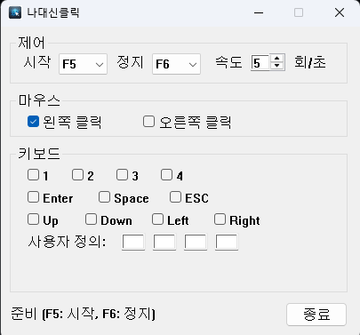

# 나대신클릭

마우스 클릭과 키보드 입력을 자동으로 반복해주는 Windows 프로그램입니다.

게임이나 반복 작업 시 손가락 피로를 줄여줍니다.

## 기능

- **마우스 자동 클릭**: 왼쪽/오른쪽 클릭 지원
- **키보드 자동 입력**: 숫자키(1-4), Enter, Space, ESC, 방향키
- **사용자 정의 키**: 최대 4개의 커스텀 키 설정
- **속도 조절**: 초당 1~100회 반복
- **핫키 설정**: F1~F12 중 시작/정지 키 선택

## 스크린샷



## 설치

### 다운로드

[Releases](https://github.com/junsik/nadaesinclick/releases) 페이지에서 최신 버전을 다운로드하세요.

### 직접 빌드

#### 요구사항
- Windows 10 이상
- Visual Studio 2022 또는 MinGW-w64

#### CMake (Visual Studio)
```bash
mkdir build && cd build
cmake -G "Visual Studio 17 2022" ..
cmake --build . --config Release
```

#### MinGW
```bash
make
```

## 사용법

1. 프로그램 실행
2. 원하는 마우스/키보드 옵션 선택
3. 속도 설정 (기본값: 5회/초)
4. **F5**를 눌러 시작, **F6**을 눌러 정지

## 단축키

| 키 | 기능 |
|---|---|
| F5 (기본) | 시작 |
| F6 (기본) | 정지 |

시작/정지 키는 F1~F12 중 변경 가능합니다.

## 빌드 상태

[](https://github.com/junsik/nadaesinclick/actions/workflows/build.yml)

## 라이선스

MIT License - 자유롭게 사용, 수정, 배포할 수 있습니다.

## 기여

이슈와 PR을 환영합니다!
